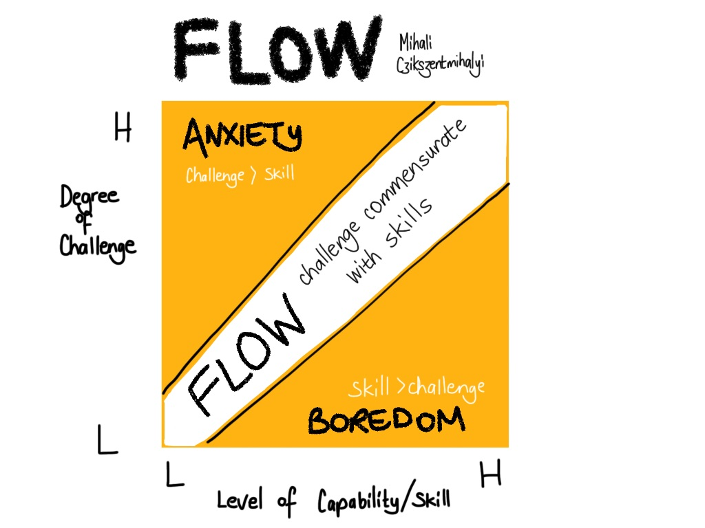

# Learning Process

###  1.  What is the Feynman Technique? Explain in 1 line.

Feynman Technique is teaching the concept you've learned in simple terms as if you are teaching it to someone else.

### 2. In [this video](https://www.youtube.com/watch?v=O96fE1E-rf8), what was the most interesting story or idea for you?

- The fact that Salvador Dali and Thomas Edison used relaxation techniques to intentionally switch into diffuse mode of thinking to solve problems creatively.

- Traits that seem like weaknesses, such as poor working memory, can actually increase creativity and lead to a deeper understanding.

### 3.  What are active and diffused modes of thinking?

- **Active Mode**:
    - You actively try to concentrate on somthing you are trying to understand or learn.
    - Activates well established neural pathways of the brain.

- **Diffused Mode**:
    - This is more relaxed state of thinking.
    - Thoughts and corresponding neural pathways are sparesely spread out throughout the brain, which allows for unxepected insights.

### 4. According to [this video](https://www.youtube.com/watch?v=5MgBikgcWnY), what are the steps to take when approaching a new topic? Only mention the points.

- Break down the topics into smaller, learnable pieces.
- Learn just enough to self-correct and notice mistakes while practicing.
- Remove any blockers or distractions that get in the way of practice.
- Commit beforehand to practicing for at least 20 hours to overcome the initial frustration barrier.

### 5. What are some of the actions you can take going forward to improve your learning process?

- Set achievable goals:
    - Have achievable goals to have small-wins dopamine hit.
    - Have some deadlines and path to follow.

- Learn by teaching:
    - I should be able to teach the concpets in simple terms.

- Maintain focus:
    - To have better focus at the task, I should aim to keep my task difficulty level just enough to enjoy the process, and induce flow state.
  </img>

- Avoid distractions:
    - Reduce distractions as much as possible when trying to learn or when doing some task.